  

  
<strong>Text version</strong>

   

  **Eduardo Córdova — Creative Frontend & Full-Stack Developer**

  Developer with experience in interactive web experiences, business applications, APIs and data-driven products. My knowledge covers visual interfaces, motion, 3D, frontend architecture, backend development and databases.

  **Knowledge**

  - **Frontend:** responsive interfaces, SPAs, dashboards, component systems, state management and accessibility.
  - **Motion & 3D:** GSAP animations, scroll experiences, SVG, canvas, WebGL, Three.js and interactive storytelling.
  - **Full Stack:** REST APIs, authentication, roles, business logic, databases, payments, storage and reporting.

  **Project background**

  Experience across administrative and operational systems, marketplaces, e-commerce, customer portals, photography and fitness platforms, healthcare, logistics, equipment-maintenance tools and creative websites with motion and 3D.

  Applied areas include inventory, sales, purchasing, accounting, treasury, human resources, budgets, assets, work orders, maintenance, appraisals, permissions, dashboards, real-time data, cloud services, payments and digital content delivery.

  **Technologies**

  HTML · CSS · JavaScript · TypeScript · Vue · React · Vite · PHP · Laravel · Node.js · PostgreSQL · MySQL · Supabase · Firebase · Three.js · Git · GSAP · ScrollTrigger · Lenis · WebGL · REST APIs · Stripe · AWS S3

