  

  
  
  

<h2 align="center">Creative Frontend & Full-Stack Developer</h2>

  I combine visual direction, motion and 3D with the architecture behind complete digital products. 
  My experience ranges from immersive web experiences to business platforms, APIs and data-driven applications.

---

## ✦ Core expertise

<table>
  <tr>
    <td width="33%" valign="top">
      <h3>🎬 Creative Frontend</h3>
      
Responsive interfaces, motion systems, scroll storytelling, SVG, canvas and immersive WebGL experiences.

    </td>
    <td width="34%" valign="top">
      <h3>🧩 Application Development</h3>
      
SPAs, dashboards, reusable components, state management and accessible product interfaces.

    </td>
    <td width="33%" valign="top">
      <h3>⚙️ Backend & Data</h3>
      
APIs, authentication, roles, business logic, databases, reporting, payments and file storage.

    </td>
  </tr>
</table>

---

## ✦ Selected experience

  
<strong>🌌 Capital Marketing — immersive brand experience</strong>

   
  A modular brand website combining cinematic navigation, GSAP motion, smooth scrolling and a lazy-loaded Three.js showroom.
    
  <strong>Stack:</strong> JavaScript · GSAP · ScrollTrigger · Three.js · Lenis · Vite · PHP
   
  <strong>Live:</strong> <a href="https://capitalmarketing.agency">capitalmarketing.agency</a>

  
<strong>📊 Business and operational platforms</strong>

   
  Full-stack systems for inventory, sales, purchasing, customers, logistics, healthcare operations, assets, treasury, dashboards and reporting.
    
  <strong>Stack:</strong> Vue 3 · Laravel · PHP · Vuetify · Pinia · PostgreSQL · MySQL

  
<strong>🛍️ Digital products and commerce</strong>

   
  Marketplaces, photography delivery, customer portals and fitness experiences with authentication, payments, cloud storage, real-time data and interactive interfaces.
    
  <strong>Stack:</strong> Vue · React · TypeScript · Laravel · Supabase · Firebase · Stripe · AWS S3

---

## ✦ Essential stack

  

  
  
  
  
  
  

---

## ✦ Engineering principles

`Motion with purpose` · `Modular architecture` · `Responsive design` · `Performance` · `Accessibility` · `Secure integrations`

  <strong>Design with intention. Build with structure. Move with purpose.</strong>
   
  Eduardo Córdova · Creative Developer

