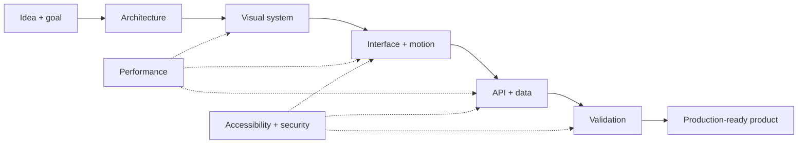

  

  
  
  

<h3 align="center">I design experiences that feel alive and build systems that solve real problems.</h3>

  Creative Frontend · Full-Stack Systems · Motion Design · 3D/WebGL · Product Engineering

  <a href="#about">About</a> •
  <a href="#capabilities">Capabilities</a> •
  <a href="#projects">Projects</a> •
  <a href="#stack">Stack</a> •
  <a href="#process">Process</a> •
  <a href="#contact">Contact</a>

---

## ✦ About

Hi, I am **Eduardo Córdova**, a developer focused on creating digital products where engineering and visual direction operate as one system.

I work across two worlds that are often treated separately: **creative frontend**, shaped by motion, interaction, storytelling and 3D; and **full-stack development**, powered by APIs, authentication, databases, admin platforms and real business logic.

<table>
  <tr>
    <td width="50%" valign="top">
      <h3>◈ What I build</h3>
      
Immersive websites, portfolios, brand experiences, business platforms, SaaS products, marketplaces, dashboards and digital commerce systems.

    </td>
    <td width="50%" valign="top">
      <h3>✦ How I build</h3>
      
Modular architecture, responsive interfaces, purposeful motion, secure APIs, predictable state, progressive loading and production-minded validation.

    </td>
  </tr>
</table>

  
<strong>🧭 My development philosophy</strong>

   
  I do not add effects simply to make an interface move. Every transition should explain something, every interaction should answer an intention, and every technical decision should support the product over time. I care about memorable experiences, but also about the performance, accessibility, security and maintainability behind them.

---

## ✦ Capability map

<table>
  <tr>
    <td width="25%" valign="top">
      <h3>🎬 Creative Frontend</h3>
      
Motion systems, scroll storytelling, microinteractions, custom cursors, SVG, canvas, WebGL and immersive 3D.

    </td>
    <td width="25%" valign="top">
      <h3>🧩 Frontend Apps</h3>
      
SPAs, routing, global state, reusable components, dashboards, forms and responsive design systems.

    </td>
    <td width="25%" valign="top">
      <h3>⚙️ Backend & APIs</h3>
      
REST APIs, authentication, roles, permissions, business logic, reporting and file storage.

    </td>
    <td width="25%" valign="top">
      <h3>🚀 Product Delivery</h3>
      
Domain modeling, frontend/backend integration, builds, performance, security and deployment workflows.

    </td>
  </tr>
</table>

### What I can take from idea to product

- **Brand experiences:** visual direction, content architecture, cinematic navigation and interactive storytelling.
- **Business applications:** inventory, sales, purchasing, cash management, assets, accounting, reporting, users and permissions.
- **Digital commerce:** catalogs, carts, checkout, payments, protected files and customer portals.
- **Dashboards:** metrics, charts, filters, maps, PDF/Excel exports and operational visibility.
- **Modular platforms:** independent APIs, decoupled SPAs, token authentication and domain-oriented architecture.
- **High-impact interfaces:** Three.js, GSAP, ScrollTrigger, Lenis, parallax, particles and responsive motion.

---

## ✦ Projects and applied experience

> Some of my work lives in private repositories because it involves client products, internal systems or ongoing experiments. The sections below describe the challenges and capabilities without exposing confidential information.

<em>Open each section to explore.</em>

  
<strong>🌌 Capital Marketing — immersive digital experience</strong>

   

  A brand SPA that combines storytelling, cinematic navigation, dynamic service journeys and a 3D showroom, turning a corporate website into a complete digital experience.

  **What I built:**

  - A modular vanilla architecture with independent views and lifecycle management.
  - A lazy-loaded Three.js portfolio with separated scene, camera, particles and interaction modules.
  - GSAP timelines, ScrollTrigger narratives and smooth scrolling synchronized with Lenis.
  - A bilingual content system, responsive effects and `prefers-reduced-motion` support.
  - First-paint protection, progressive loading and code splitting for heavier experiences.

  **Stack:** JavaScript ES Modules · GSAP · ScrollTrigger · Three.js · Lenis · Vite · PHP

  **Live:** [capitalmarketing.agency](https://capitalmarketing.agency)

  
<strong>📊 Administrative and operational platforms</strong>

   

  Business systems created for healthcare, logistics, inventory, fixed assets, sales, treasury and administrative operations.

  **Applied capabilities:**

  - Vue 3 SPAs using Vue Router, Pinia/Vuex, Vuetify and Vite.
  - Modular Laravel APIs with Sanctum/JWT authentication and domain separation.
  - Users, roles, permissions, companies, branches and protected sessions.
  - Inventory, purchasing, sales, suppliers, customers, cash flow, budgeting and asset management.
  - Dashboards, charts, maps, PDF reports, data exports and operational documents.
  - Large interfaces connected to extensive APIs with hundreds of functional routes.

  **Stack:** Vue 3 · Laravel · PHP · JavaScript · Vuetify · Pinia · Axios · Chart.js · PostgreSQL/MySQL

  
<strong>📸 Photography commerce and digital delivery platform</strong>

   

  A full-stack product for presenting services and albums, selling photography and delivering digital content through controlled access.

  **Applied capabilities:**

  - Galleries, albums, shopping cart, checkout and a customer portal.
  - Stripe payment integration.
  - Signed downloads, access tokens and protected file streaming.
  - Image processing and S3-compatible object storage.
  - Social authentication, event analytics and an administration dashboard.
  - A visual Vue frontend enhanced with GSAP, Lenis and SplitType.

  **Stack:** Vue 3 · Laravel · Stripe · AWS S3 · Intervention Image · GSAP · Tailwind CSS

  
<strong>🏋️ Fitness platform with data, community and intelligent support</strong>

   

  A performance-oriented product with dedicated experiences for users and coaches.

  **Applied capabilities:**

  - Health dashboards, routines and progress tracking.
  - Coach/client chat, marketplace features and gamification.
  - Authentication, storage and real-time data services.
  - Internationalization and AI-assisted user experiences.

  **Stack:** React · TypeScript · Supabase · Firebase · Express · Tailwind CSS · Motion

  
<strong>🛍️ Marketplaces, CRM and customer management</strong>

   

  Products centered on user onboarding, business administration, commercial profiles and customer operations.

  **Applied capabilities:**

  - Registration, login, protected sessions and editable profiles.
  - Dashboards for managing shops, users, roles and customer records.
  - Robust forms, activation states, filtering and record search.
  - Decoupled Laravel APIs and Vue interfaces.

  **Stack:** Vue 3 · Laravel · Sanctum · Pinia · Tailwind CSS · REST APIs

  
<strong>🎮 Personal experiences and experimental interfaces</strong>

   

  Projects where I explore interaction, emotion and technology beyond the constraints of conventional dashboards.

  **Experiments include:**

  - 3D portfolios with ruins, particles, audio, custom cursors and kinetic typography.
  - Curved galleries, WebGL sliders, preloaders, marquees and spatial navigation.
  - Mini games, virtual pets, puzzles, Simon Says and interactive canvas experiences.
  - Narrative websites with page transitions, horizontal scroll and editorial composition.

  **Stack:** Vanilla JavaScript · Vue 3 · GSAP · Three.js · Lenis · Canvas · WebGL

  
<strong>☁️ Technology services and digital strategy platform</strong>

   

  A multipage experience presenting cloud, cybersecurity, software, infrastructure and digital marketing services through a technical and dynamic visual identity.

  **Applied capabilities:**

  - A PHP architecture organized around pages, services and shared components.
  - GSAP timelines, ScrollTrigger, MotionPath and page transitions.
  - SVG-driven narratives, data routes and pointer-based parallax.
  - Readable fallbacks for no-JavaScript and reduced-motion environments.

  **Stack:** PHP · JavaScript · GSAP · ScrollTrigger · MotionPath · SCSS · SVG

  
<strong>📰 CMS, content and e-commerce ecosystems</strong>

   

  Experience working with content-driven platforms and established CMS ecosystems, including media libraries, themes, plugins, forms, analytics and commerce extensions.

  **Applied capabilities:**

  - WordPress environment configuration and content workflows.
  - Theme and plugin integration across editorial and commercial experiences.
  - Media management, forms, analytics and performance-oriented configuration.
  - Working safely around third-party code while keeping custom responsibilities isolated.

  **Stack:** WordPress · PHP · CSS · JavaScript · MySQL · WooCommerce ecosystem

---

## ✦ Technical stack

### Frontend

  
  
  
  
  
  
  
  
  
  
  

### Motion, interaction and 3D

  
  
  
  
  
  
  

### Backend, data and services

  
  
  
  
  
  
  
  
  
  
  

### Architecture and quality

`REST APIs` · `SPA Architecture` · `JWT / Sanctum` · `RBAC` · `Responsive Design` · `Accessibility` · `i18n` · `Lazy Loading` · `Code Splitting` · `Performance` · `Git` · `Composer` · `npm`

---

## ✦ How I work

<table>
  <tr>
    <td align="center" width="16%"><strong>01</strong> Understand</td>
    <td align="center" width="16%"><strong>02</strong> Architect</td>
    <td align="center" width="16%"><strong>03</strong> Design</td>
    <td align="center" width="16%"><strong>04</strong> Build</td>
    <td align="center" width="16%"><strong>05</strong> Refine</td>
    <td align="center" width="16%"><strong>06</strong> Validate</td>
  </tr>
</table>

  
<strong>01 — Product and domain</strong>

   I identify users, goals, flows, constraints and data before choosing technology or designing motion.

  
<strong>02 — Architecture</strong>

   I separate responsibilities, define boundaries between interface, state, API and domain, and create explicit lifecycles for each experience.

  
<strong>03 — Visual system and motion</strong>

   I build hierarchy, rhythm, depth and continuity. Motion supports navigation and communicates state; it does not exist only as decoration.

  
<strong>04 — Integration</strong>

   I connect frontend, backend, authentication, storage and external services while keeping errors controlled and application states understandable.

  
<strong>05 — Performance and accessibility</strong>

   I optimize initial loading, images, bundles and animation workloads, adapt interactions for mobile and respect reduced-motion preferences.

  
<strong>06 — Validation</strong>

   I verify builds, routes, imports, runtime errors, responsive behavior, duplicated listeners and lifecycle stability before considering work complete.

---

## ✦ Lab

Beyond product work, I explore emerging tools and architectures:

- **Model Context Protocol (MCP)** integrations and tools for coding agents.
- Self-hosted AI workspaces, semantic search and multi-tool workflows.
- Python/TypeScript automation and real-time communication.
- WebGL, 3D scenes, particle systems and spatial navigation patterns.
- Secure architectures for products combining data, AI and human interfaces.

This is an experimentation space: I study, adapt and integrate external tools without presenting third-party code as my own work.

---

## ✦ Let us connect

<table>
  <tr>
    <td width="65%" valign="middle">
      <h3>Have an idea that deserves to feel different?</h3>
      
I am interested in products where design, interaction and technology can elevate one another.

    </td>
    <td width="35%" align="center" valign="middle">
      <a href="https://capitalmarketing.agency"><strong>Explore my work ↗</strong></a>  
      <a href="https://github.com/CANTARERO8"><strong>Follow me on GitHub ↗</strong></a>
    </td>
  </tr>
</table>

  

---

  <strong>Design with intention. Build with structure. Move with purpose.</strong>
   
  Eduardo Córdova · Creative Developer

